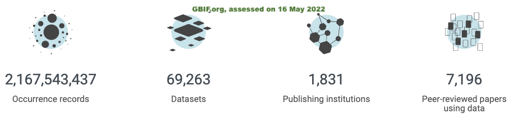

---
presentation:
  theme: solarized.css
  slideNumber: true
  overview: true
  width: 1280
  height: 720
  margin: 0.1
---

<!-- slide data-background-image="images/T4F_WWFSAM.png" data-background-size="contain" data-background-position="left"-->

## GBIF in the cloud

Belgian Biodiversity Platform
29 June 2022 André Heughebaert,
Sebastien Ronveaux & Maxime Coupremanne

---

<!-- slide  data-background-image="images/T4F_WWFSAM.png" data-background-size="contain" data-background-position="left"-->
### Summary
* Introduction
* Practicalities
* Part I: Small Data
* Part II: Big Data
* Conclusion

<!-- slide -->
## Introduction
You will have the opportunity to elaborate simple IT solutions similar to those needed by real scientific analysis. The workshop will cover the **discovery, query, filtering of data** but also the **plotting** into visually effective diagrams.

<!-- slide  vertical=true -->
## Introduction
You will work at two levels(small and big data), you will be able to develop and run solutions both locally on their laptop and on remote servers in the cloud. You will have the opportunity to **create, write and run** their code using two excellent Data Science tools : **Jupyter and Databricks** notebooks.

<!-- slide  vertical=true -->
## Introduction
Data science tools of the day:
* [Jupyter](https://jupyter.org/)
* [Azure/Databricks](https://azure.microsoft.com/en-us/services/databricks/#overview)
* [RawGraphs](https://www.rawgraphs.io/about)

>What will you do?
>**Discover, query, filter, plot and visualise** GBIF occurrences

<!-- slide  vertical=true data-background-image="images/T4F_WWFSAM.png" data-background-size="contain" data-background-position="left"-->
When/where were the Bivalvia specimens collected?

<!-- slide vertical=true data-background-image="images/T4F_WWFSAM.png" data-background-size="contain" data-background-position="left"-->

## About GBIF
---

<!-- slide  vertical=true data-background-image="images/T4F_WWFSAM.png" data-background-size="contain" data-background-position="left"-->
## About GBIF
Occurrences snapshots are available on the cloud:
Amazon, Microsoft Planatary Computer (Azure), Google
see [GBIF news, 21 May 2021](https://www.gbif.org/news/4Uyr7RpdcoeavzLBGRqX7k/gbif-forecast-increasing-chance-of-clouds-for-species-occurrence-data)

<!-- slide  vertical=true data-background-image="images/T4F_WWFSAM.png" data-background-size="contain" data-background-position="left"-->
### What? ⇄ Where? ⇄ When?

<!-- slide  vertical=true -->
Of course, additional information are attached to these points such as **events, methods, measurements or environmental** data.
But, let's have a look at the DarwinCore fields that correspond to our 3 dimensions (what? where? when?).

<!-- slide vertical=true data-background-image="images/T4F_WWFSAM.png" data-background-size="contain" data-background-position="left"-->
### 1. Taxonomy(=what?)
kingdom, phylum, class, order,
family, genus, species, infraspecificEpithet,
taxonRank, taxonKey, **speciesKey**, scientificName, verbatimScientificName,
verbatimScientificNameAuthorship

<!-- slide vertical=true data-background-image="images/T4F_WWFSAM.png" data-background-size="contain" data-background-position="left"-->
### 2. Geography(=where?)
**countryCode**, locality, stateProvince,
**decimalLatitude**, **decimalLongitude**,
coordinateUncertaintyInMeters, coordinatePrecision,
elevation, elevationAccuracy, depth, depthAccuracy

<!-- slide vertical=true data-background-image="images/T4F_WWFSAM.png" data-background-size="contain" data-background-position="left"-->
### 3. Time(=when?)
eventDate, day, month, **year**

<!-- slide  vertical=true data-background-image="images/T4F_WWFSAM.png" data-background-size="contain" data-background-position="left"-->
Others DarwinCore fields of interest:
**gbifID**, datasetKey, occurrenceID, occurrenceStatus,
 **individualCount**, **publishingOrgKey**, **basisOfRecord**,
  institutionCode, collectionCode, catalogNumber,
  recordNumber, identifiedBy, dateIdentified,
  license, rightsHolder, recordedBy, **typeStatus**,
  establishmentMeans, lastInterpreted, mediaType,
  **issues**

<!-- slide  vertical=true data-background-image="images/T4F_WWFSAM.png" data-background-size="contain" data-background-position="left"-->
## Granularity

<!-- slide  vertical=true -->
Granularity affects the number of cells in our 3DCube.
If we choose **years**, **species** and **Lat/long (1x1°) squares**, we'll have zillion of cells.

> 25.920.000.000.000 cells (=200 years * 2.000.000 species * 64.800 squares)

We take **decades**, **classes** and **countries**, the number of cells becomes more manageable.
> 2.000.000 cells (= 20 decades * 400 classes * 250 countries)

<!-- slide  data-background-image="images/T4F_WWFSAM.png" data-background-size="contain" data-background-position="left"-->
## Practicalities
|||
|-|-|
|09:00- 09:30|Introduction|
|09:30- 12:30|PartI Small Data|
|12:30- 13:30|*---lunch break---*|
|13:30- 16:30|PartII Big Data|
|16:30- 17:00|Conclusion|

<!-- slide  vertical=true data-background-image="images/T4F_WWFSAM.png" data-background-size="contain" data-background-position="left"-->
## Practicalities
>Wi-Fi: **WTC-Guest**
>Password: **WTC0nTh34ir!**

<!-- slide  vertical=true data-background-image="images/T4F_WWFSAM.png" data-background-size="contain" data-background-position="left"-->
## Part I: Small Data
>JupyterHub
>[https://sandbox.bebif.be/jupyter](https://sandbox.bebif.be/jupyter)
>login=user{x}
>password='ebr'

<!-- slide  vertical=true data-background-image="images/T4F_WWFSAM.png" data-background-size="contain" data-background-position="left"-->
## Part II: Big Data
>[azureDatabricks](https://adb-236759343319441.1.azuredatabricks.net/)
>https://adb-236759343319441.1.azuredatabricks.net/
>login=training{x}@gbifcloudtraining.onmicrosoft.com
>password='PumaTraining2022'

<!-- slide  vertical=true data-background-image="images/T4F_WWFSAM.png" data-background-size="contain" data-background-position="left"-->
## Raw Graphs
>[https://sandbox.bebif.be/rg/](https://sandbox.bebif.be/rg/)
>no login!

<!-- slide  data-background-image="images/T4F_WWFSAM.png" data-background-size="contain" data-background-position="left"-->
## Part I : Small Data
We will analyze the specimens of Ghent University,
**about 28.000 records**

>* Ex0 on GBIF.org
>* Ex1-4 on Jupyter
 with **Python & pandas**
>* Ex5 on RawGraphs

<!-- slide vertical=true -->
## SP_Ex0
On GBIF.org, download occurrences:
- preserved collection specimens
 (**basisOfRecord** = 'preserved specimen')
- from Ghent University Data provider (**publishingOrgKey**=05c249d0-dfa0-11d8-b22e-b8a03c50a862)
> Observe the downloaded records
> What records would you exclude? Why?

<!-- slide vertical=true -->
## SP_Ex1
1. Load occurrences in a dataframe
2. Extract these columns: **gbifID, individualCount, countryCode, year, class, speciesKey**
3. Discard records with null() values
4. Save results in 'EX1.csv'
> How many records do you have?

<!-- slide vertical=true -->
## SP_Ex2
1. Load EX1.csv in a dataframe
2. group occurences by class, country and decade

> How many records for 'Insecta'?
> How many records for 'Belgium'?
> How many records for '1961'?
> How many Belgian Insecta records for 1960s?

<!-- slide vertical=true -->
## SP_Ex3
1. Count the number of records, numbers of specimens and species
2. Our data cube consists of 3D : **decade, countries and classes**. For each cell in this cube, add **rcount**(#records), **icount**(#specimens), **scount** (#species)
3. Save your data cube in EX3.csv file

<!-- slide vertical=true -->
## SP_Ex3
Inspect three cells of your data cube:
* A= Aves, Belgium, 1920s
* B= Insecta, Belgium, 1900s
* C= Insecta, Belgium, 1950s

> * How many records ?
> * How many specimens ?
> * How many species ?

<!-- slide vertical=true -->
## SP_Ex4
1. Load your Data Cube(EX3.csv)
2. Filter the Insecta cells, discard the others
3. Load Countries.csv in a dataframe
4. Join the two dataframe on countryCode
5. Add country region and  sub-region
6. Save your results (export this data cube in a CSV file)

> How many **non empty** cells do you have? (rcount,icount,scount!=0)

<!-- slide vertical=true -->
## SD_Ex5
1. Upload your datacube on [RawGraphs.io](https://app.rawgraphs.io/)
2. Choose *Beeswarm plot* chart
3. Mapping
  3.1. XAxis= decade
  3.2. Size=#numberRecords/Specimens/Species
  3.3. Color=sub-region
  3.4. Groups=region
4. Customize your graph
  4.1. ShowLegend
  4.2 Chart/diameter= 1-40
  4.2 Color/ColorScheme= turbo discrete
5. Export the resulting graph in appropriate format

<!-- slide vertical=true data-background-image="images/T4F_WWFSAM.png" data-background-size="contain" data-background-position="left"-->
## SD_Ex5
>Are there differences between the regions?
>Are there gaps in time(decade) or geography(country, region, sub-region?
>Which regions/subregions offer the highest biodiversity(number of species)?
>Where would you recommend to collect specimens today?

<!-- slide vertical=true -->
## SQL exercises 2-4
(If time allows, re-implement exercises 2-4 with SQL)

<!-- slide  data-background-image="images/T4F_WWFSAM.png" data-background-size="contain" data-background-position="left"-->
## Part II : Big Data
We will now analyze
**all collection specimens** available on GBIF,
(about 200 million records).
from an [occurrences snapshot](https://www.gbif.org/occurrence-snapshots)
with **Databricks and SQL**

<!-- slide vertical=true -->
## BD_Ex1

1. Create a new notebook
2. Create/explore your database
3. Create a view on all specimens records
4. Explore the data

>How many occurrences and specimens?
>How many with year, country and class?
>What other records would you exclude? Why?

<!-- slide vertical=true -->
## BD_Ex2
1. Create a specimen view (year, class and countryCode not null)
2. Subset with 'gbifID', 'individualCount','countryCode', 'year', 'class', 'speciesKey'
3. Drop rows with null values
4. Describe the resulting data

>Which ‘class’ has more specimens records?
>Which ‘class’ has more distinct species of specimens?
>Which ‘class’ has more individual specimens?

<!-- slide vertical=true -->
## BD_Ex3
* Create a DataCube view based on **class, country and year**
* Add to each cell:
  * Number of records
  * Number of specimens
  * Number of species

<!-- slide vertical=true -->
## BD_Ex3
Inspect three cells of your data cube:
  *  cell A (Aves, Australia, 1920s)
  *  cell B (Insecta, Australia, 1900s)
  *  cell C (Insecta, Australia, 1950s)

>  How many records?
>  How many specimens?
>  How many species?

<!-- slide vertical=true -->
## BD_Ex4
1. Explore your datacube
2. Explore Countries table
3. Join the two on countryCode, add country’s region and  sub-region
4. Select the class you want to analyze
5. Export your datacube for that class

>Which region, subregion have the most records?
>Which region, subregion have the most specimens?
>Which region, subregion have the most species?

<!-- slide vertical=true -->
## BD_Ex5
1. Upload your datacube on [RawGraphs.io](https://app.rawgraphs.io/)
2. Choose *Beeswarm plot* chart
3. Mapping
  3.1. XAxis= decade
  3.2. Size=#numberRecords/Specimens/Species
  3.3. Color=sub-region
  3.4. Groups=region
4. Customize your graph
  4.1. ShowLegend
  4.2 Chart/diameter= 1-40
  4.2 Color/ColorScheme= turbo discrete
5. Export the resulting graph in appropriate format

<!-- slide vertical=true data-background-image="images/T4F_WWFSAM.png" data-background-size="contain" data-background-position="left"-->
## BD_Ex5
>Are there differences between the regions?
>Are there gaps in time(decade) or geography(country, region, sub-region?
>Which regions/subregions offer the highest biodiversity(number of species)?
>Where would you recommend to collect specimens today?

<!-- slide data-background-image="images/T4F_WWFSAM.png" data-background-size="contain" data-background-position="left"-->

## Conclusions
Today, you played with:
> Jupyter (Python & Pandas)
> Databricks (SQL)
> RawGraphs.io
> GBIF occurrences
> Darwin Core

<!-- slide vertical=true data-background-image="images/T4F_WWFSAM.png" data-background-size="contain" data-background-position="left"-->
Discussion and Survey:
* Did you learn something?
* What did you like/dislike?
* Will you use these tools in the future?
* How would you improve the workshop?

<!-- slide data-background-image="images/T4F_WWFSAM.png" data-background-size="contain" data-background-position="left"-->

## THANK YOU!
✉️ [@andrejjh](mailto:a.heughebaert@biodiversity.be) on twitter

<small>and thanks to **Carlos Alberto GH** Mexican street art painter,
WWF & Street Art for Mankind [Together4Forests](https://www.wwf.eu/campaigns/together4forests/mural/) campaign </small>
